# **Pendahuluan**

Download data AHA Database Sample Excluded Record dari [Physionet.org](http://Physionet.org). Record yang akan diproses adalah Record 0001\.

```m
base = 'https://physionet.org/files/ahadb/1.0.0/';
rec = '0001';

opts = weboptions('Timeout',60);

websave([rec '.hea'], [base rec '.hea'], opts);
websave([rec '.dat'], [base rec '.dat'], opts);
websave([rec '.atr'], [base rec '.atr'], opts);
```

Load Waveform Database Software Package (WFDB) dan arahkan direktori ke workspace.

```m
addpath '/home/aliy/Documents/matlab/mcode';
cd '/home/aliy/Documents/PhysioNetData/UTS';
```

# **1\. Akuisisi dan Visualisasi Data Raw**

Ambil parameter dari header Record 0001 dengan diperoleh **Fs \= 250 Hz**. Channel yang diambil adalah kolom ke-2 dan hanya diambil sampel selama 10 detik dari awal perekaman.

```m
[sig, Fs, tm] = rdsamp('0001');
idx = tm <= 10; % 10 detik
ch = 2;
```

Kemudian visualisasikan rekaman 10 detik tersebut.

```m
plot(tm(idx), sig(idx,ch)); grid on
xlabel('Time (s)'); ylabel('ECG')
title('AHA ECG: 0001 (first 10 seconds)')
```

Hasil plot:

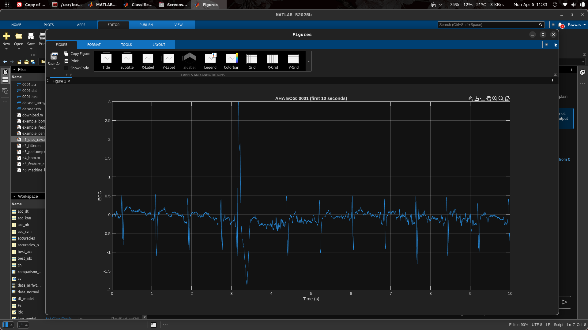

Terlihat bahwa data raw masih terdapat noise.

# **2\. Proses Filtering**

Sebelum diproses, sinyal terlebih dahulu dibebaskan dari noise agar hasil proses maksimal.

Proses filtering menerapkan proses kombinasi filter (FIR Band-Stop Filter) untuk mengurangi noise pada **50 Hz** sebagai interferensi listrik. Pada parameter order disamakan dengan frekuensi nyquist yaitu setengah dari frekuensi sampling (**125 Hz**).

```m
y = sig(idx, ch);
t = tm(idx);

% FIR Band-stop (Notch)
order = 124;          % 125 digenapkan ke 124 untuk menghindari warning
stop_hz = [49 51];    % rentang frekuensi yang dibuang, sekitar 50 Hz
Wn = stop_hz/(Fs/2);         % normalisasi (0..1)
b  = fir1(order, Wn, 'stop');  % FIR band-stop
y2 = filtfilt(b, 1, y);      % zero-phase filter untuk menghindari delay
```

Gunakan zero-phase filter untuk menghindari delay. Kemudian hitung SNR.

```m
% Hitung SNR
y_energy = mean(y.^2);        % energi sinyal asli
snr = 10*log10(y_energy / mean((y - y2).^2));  % SNR dalam dB
```

Kemudian visualisasikan hasil filter dan bandingkan dengan data sebelum filter.

```m
% Plot sebelum & sesudah
figure('Color','black');
tiledlayout(2,1,'Padding','compact','TileSpacing','compact');

nexttile % plot atas
plot(t, y); grid on
title(sprintf('Before Filter (ECG-ID 0001, ch %d)', ch))
xlabel('Time (s)'); ylabel('ECG (mV)')

nexttile % plot bawah
plot(t, y2); grid on
title(sprintf('After FIR Band-stop %.0f–%.0f Hz (order=%d) | SNR = %.2f dB', stop_hz(1), stop_hz(2), order, snr))
xlabel('Time (s)'); ylabel('ECG (mV)')
```

Hasil plot:

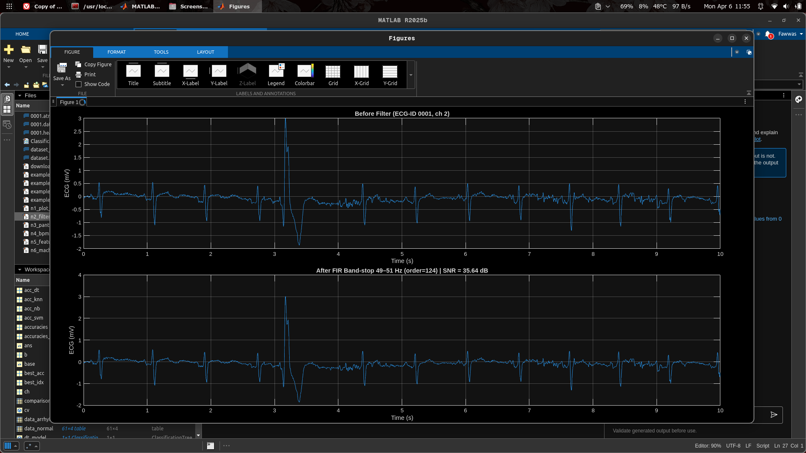

Mendapatkan SNR sekitar **35.64 dB** yang dimana filter berhasil mengurangi beberapa noise.

# **3\. Deteksi Lokasi R-Peak**

Untuk mendeteksi lokasi dari R-Peak, dapat menggunakan fungsi Pan-Tompkins.

Sinyal yang difilter, didiferensiasi untuk menonjolkan perubahan cepat (QRS), lalu dikuadratkan agar semua nilai positif dan puncak QRS makin jelas.

```m
% Deteksi R-peak dengan Pan-Tompkins
ecg = y2;  % menggunakan sinyal yang sudah difilter
d_ecg = [0; diff(ecg)] * Fs; % diferensasi sederhana
sq_ecg = d_ecg.^2; % squaring
```

Dilakukan rata-rata bergerak (**100 ms**) untuk menghaluskan sinyal dan menonjolkan energi QRS agar mudah dideteksi.

```m
% Moving Window Integration (MWI)
mwi_ms = 100; % 100 ms lebih akurat
win = max(1, round((mwi_ms/1000)*Fs));
mwi = movmean(sq_ecg, win);
```

Lalu, ambang adaptif dihitung dari median \+ standar deviasi. Findpeaks digunakan untuk mendeteksi kandidat QRS dengan jarak minimal antar puncak (≈ denyut jantung realistis).

```m
% Adaptif Threshold + QRS Detection
thr = median(mwi) + 0.5 * std(mwi);
min_distance = round(0.3 * Fs);
[~, mwi_locs] = findpeaks(mwi, 'MinPeakHeight', thr, 'MinPeakDistance', min_distance);
```

Kemudian setiap kandidat diperbaiki dengan mencari nilai maksimum sinyal ECG asli di sekitar **±50 ms**, sehingga posisi R-peak lebih akurat.

```m
% Konversi lokasi puncak MWI
search_win = round(0.05 * Fs);  % cari maksimum ECG di ±50 ms
r_locs = zeros(size(mwi_locs));
for i = 1:numel(mwi_locs)
   L = max(1, mwi_locs(i) - search_win);
   R = min(length(ecg), mwi_locs(i) + search_win);
   [~, rr] = max(ecg(L:R));
   r_locs(i) = L + rr - 1;
end
r_locs = unique(r_locs);
r_times = t(r_locs);
```

Visualisasikan hasil deteksi R-peak bersama dengan sinyal ECG dan menampilkan waktu kemunculan peak pada terminal.

```m
% Plot Deteksi R-peak
figure('Color','black');
plot(t, y2); grid on; hold on
plot(t(r_locs), y2(r_locs), 'ro', 'MarkerSize', 6, 'LineWidth', 1.2);
xlabel('Time (s)'); ylabel('ECG (mV)')
title('R-peak Detection (Pan-Tompkins on Filtered Signal)')
legend('ECG','R-peaks','Location','best')

% Display R-peak times
disp('R-peak times (s):');
disp(t(r_locs)');
```

Hasil plot dan terminal:

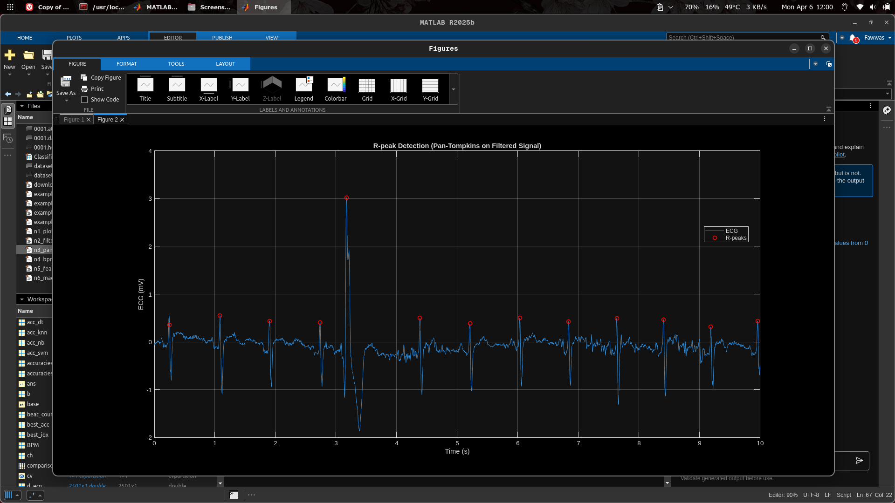

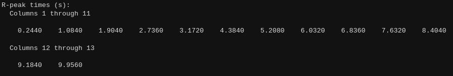

# **4\. Analisis Irama Jantung**

Jumlah detak dihitung dari banyaknya R-peak (r\_locs). Durasi sinyal dihitung dalam menit, lalu BPM diperoleh dari jumlah detak dibagi durasi tersebut.

```m
% Display BPM
beat_count = numel(r_locs);
duration_in_minutes = (length(ecg)/Fs)/60;

BPM = beat_count / duration_in_minutes;
fprintf('\nBeat terhitung : %d\n', beat_count);
fprintf('Estimasi BPM   : %.2f\n', BPM);
```

Dilakukan pengelompokan berdasarkan BPM:

- \< 60 : Bradycardia (terlalu lambat)  
- 60–100 : Normal  
- \> 100 : Tachycardia (terlalu cepat)

```m
% Klasifikasi Irama Jantung
fprintf('\n===== KLASIFIKASI IRAMA JANTUNG =====\n');
if BPM < 60
   classification = 'BRADYCARDIA';
   status = 'ABNORMAL (Detak jantung terlalu lambat)';
elseif BPM >= 60 && BPM <= 100
   classification = 'NORMAL';
   status = 'NORMAL (Detak jantung normal)';
else
   classification = 'TACHYCARDIA';
   status = 'ABNORMAL (Detak jantung terlalu cepat)';
end
fprintf('Status     : %s\n', classification);
fprintf('Keterangan : %s\n\n', status);
```

Hasil terminal:

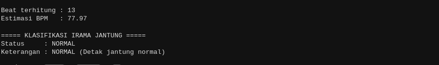

Dari hasil, menampilkan bahwa rekaman tersebut mendapatkan BPM sekitar **77.97 BPM** sehingga dikategorikan normal.

# **5\. Fitur Ekstraksi**

Kemudian dilakukan ekstraksi fitur di setiap 10 detiknya selama 1 menit perekaman.

Dikarenakan data sampel yang akan diambil selama 1 menit (**10 detik x 6 segmen**), diperlukan untuk mengambil sampel ulang. Proses filtering sama seperti sebelumnya.

```m
clc; close all;
addpath '/home/aliy/Documents/matlab/mcode';
cd '/home/aliy/Documents/PhysioNetData/UTS';

[sig, Fs, tm] = rdsamp('0001');
idx = tm <= 60; % 1 menit
ch = 2;

y = sig(idx, ch);
t = tm(idx);

% FIR Band-stop (Notch)
order = 124;            % 125 digenapkan ke 124 untuk menghindari warning
stop_hz = [49 51];        % rentang frekuensi yang dibuang, sekitar 50 Hz
Wn = stop_hz/(Fs/2);         % normalisasi (0..1)
b  = fir1(order, Wn, 'stop');  % FIR band-stop
y2 = filtfilt(b, 1, y);      % zero-phase filter untuk menghindari delay

% Plot full signal
figure('Color','black');
plot(t, y2); grid on
title('ECG Signal - Full 1 Minute (with FIR Band-stop Filter)')
xlabel('Time (s)'); ylabel('ECG (mV)')

% Ekstraksi fitur setiap 10 detik (6 segmen)
segment_dur = 10; % detik
num_segments = 6;
segment_start = [0 10 20 30 40 50]; % waktu awal setiap segmen

% Inisialisasi array untuk menyimpan fitur
segments = string.empty;
r_peaks_count = [];
avg_RR_array = [];
avg_HR_array = [];
avg_QRS_array = [];

% Inisialisasi cell array untuk menyimpan data individual beat
all_RR_intervals = {};
all_QRS_durations = {};
```

Hasil plot 1 menit rekaman:

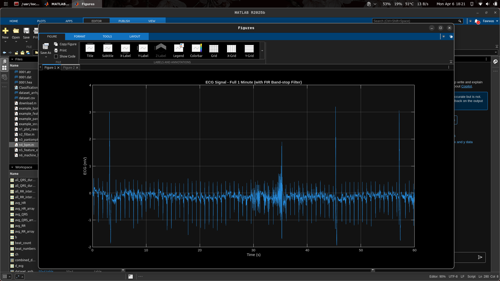

Setelah itu melakukan loop setiap segmen untuk deteksi R-Peak sama seperti sebelumnya.

```m
for seg = 1:num_segments
   start_time = segment_start(seg);
   end_time = start_time + segment_dur;

   % Ambil segmen ECG
   idx_seg = (t >= start_time) & (t < end_time);
   ecg_seg = y2(idx_seg);
   t_seg = t(idx_seg);

   % Pan-Tompkins untuk deteksi R-peaks
   d_ecg = [0; diff(ecg_seg)] * Fs;
   sq_ecg = d_ecg.^2;

   mwi_ms = 100;
   win = max(1, round((mwi_ms/1000)*Fs));
   mwi = movmean(sq_ecg, win);
   thr = median(mwi) + 0.5 * std(mwi);

   min_dist = round(0.3 * Fs);
   [~, mwi_locs] = findpeaks(mwi, 'MinPeakHeight', thr, 'MinPeakDistance', min_dist);

   % Refine R-peaks
   search_win = round(0.05 * Fs);
   r_locs = zeros(size(mwi_locs));
   for i = 1:numel(mwi_locs)
       L = max(1, mwi_locs(i) - search_win);
       R = min(length(ecg_seg), mwi_locs(i) + search_win);
       [~, rr] = max(ecg_seg(L:R));
       r_locs(i) = L + rr - 1;
   end
   r_locs = unique(r_locs);
   r_times = t_seg(r_locs);

```

Masih didalam loop, dideteksi titik Q dan S dengan Q-Peak didapatkan dari nilai minimum sebelum R dan S-Peak didapatkan dari minimum setelah R. Dilakukan dalam window **±200 ms** supaya nilai minimum lebih besar sehingga bisa lebih jauh untuk mendeteksi dari titik R.

```m
   % Deteksi Q dan S peaks
   qrs_half_ms = 200;  % 200 ms supaya terdeteksi lebih jauh lagi dari R
   qrs_half = round((qrs_half_ms/1000)*Fs);

   q_locs = zeros(size(r_locs));
   s_locs = zeros(size(r_locs));

   for i = 1:numel(r_locs)
       r = r_locs(i);

       % Q peak: minimum sebelum R
       Lq = max(1, r - qrs_half);
       Rq = r;
       [~, iq] = min(ecg_seg(Lq:Rq));
       q_locs(i) = Lq + iq - 1;

       % S peak: minimum setelah R
       Ls = r;
       Rs = min(length(ecg_seg), r + qrs_half);
       [~, is] = min(ecg_seg(Ls:Rs));
       s_locs(i) = Ls + is - 1;
   end
```

Hitung fitur: RR interval dan durasi QRS.

```m
   % FITUR: RR Interval dan Durasi QRS
   RR_vals = [];  % Initialize RR_vals
   if numel(r_times) > 1
       RR_vals = diff(r_times);
       avg_RR = mean(RR_vals);
       avg_HR = 60 / avg_RR;
   else
       avg_RR = NaN;
       avg_HR = NaN;
   end

   q_times = t_seg(q_locs);
   s_times = t_seg(s_locs);
   QRS_dur = s_times - q_times;
   avg_QRS = mean(QRS_dur); % QRS duration dalam second
```

Lalu masukkan fitur-fitur kedalam array tabel dan tampilkan tabel tersebut ke terminal.

```m
% Kumpulkan individual RR intervals dan QRS durations dalam cell array
   if numel(RR_vals) > 0
       all_RR_intervals{end+1} = RR_vals';
   end
   if numel(QRS_dur) > 0
       all_QRS_durations{end+1} = QRS_dur';
   end

   % Tambahkan ke array
   segment_label = string(sprintf('%d-%d s', start_time, end_time));
   beat_count = numel(r_locs);

   segments = [segments; segment_label];
   r_peaks_count = [r_peaks_count; beat_count];
   avg_RR_array = [avg_RR_array; avg_RR];
   avg_HR_array = [avg_HR_array; avg_HR];
   avg_QRS_array = [avg_QRS_array; avg_QRS];

   fprintf('Segment %s: R-peaks=%d, RR=%.3f s, HR=%.2f bpm, QRS=%.4f s\n', segment_label, beat_count, avg_RR, avg_HR, avg_QRS);
end

% Buat tabel fitur dari array
feature_table = table(segments, avg_RR_array, avg_QRS_array, 'VariableNames', {'Segment', 'Avg_RR_Interval_s', 'Avg_QRS_Duration_s'});

% Tampilkan Feature Table
fprintf('\n========================================\n');
fprintf('   TABEL FITUR EKSTRAKSI (NORMAL)\n');
fprintf('========================================\n\n');
disp(feature_table);
```

Hasil detail tiap segmen dan display tabel ekstraksi fitur:

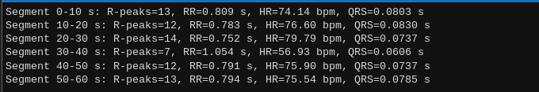

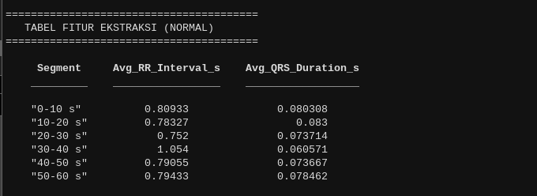

Kemudian masukkan fitur-fitur tiap beat kedalam array dan gabung dengan dataset berlabel arrhythmia yang sudah tersedia. Simpan data tersebut dalam file format CSV sebagai dataset untuk tahap machine learning.

```m
% Konversi cell array ke regular array menggunakan loop
if ~isempty(all_RR_intervals)
   all_RR_intervals_array = [];
   for i = 1:length(all_RR_intervals)
       all_RR_intervals_array = [all_RR_intervals_array; all_RR_intervals{i}(:)];
   end
else
   all_RR_intervals_array = [];
end

if ~isempty(all_QRS_durations)
   all_QRS_durations_array = [];
   for i = 1:length(all_QRS_durations)
       all_QRS_durations_array = [all_QRS_durations_array; all_QRS_durations{i}(:)];
   end
else
   all_QRS_durations_array = [];
end

% Tentukan jumlah beat total
num_beats = length(all_RR_intervals_array);

% Pastikan RR intervals dan QRS durations memiliki panjang yang sama
if length(all_QRS_durations_array) < num_beats
   % Pad dengan NaN jika diperlukan
   all_QRS_durations_array = [all_QRS_durations_array; NaN(num_beats - length(all_QRS_durations_array), 1)];
elseif length(all_QRS_durations_array) > num_beats
   all_QRS_durations_array = all_QRS_durations_array(1:num_beats);
end

% Round float values ke 5 desimal
RR_rounded = round(all_RR_intervals_array, 5);
QRS_rounded = round(all_QRS_durations_array, 5);

% Buat tabel untuk dataset normal
beat_numbers = (1:num_beats)';
labels = repmat("Normal", num_beats, 1);

dataset_normal = table(beat_numbers, RR_rounded, QRS_rounded, labels, 'VariableNames', {'Beat_No', 'R_R_Interval', 'QRS_Duration', 'Label'});

% Load dataset arrhythmia
dataset_arrhythmia_loaded = readtable('dataset_arrhythmia.csv');

% Re-numerate beat_no untuk dataset arrhythmia agar continuous
num_arrhythmia = height(dataset_arrhythmia_loaded);
new_beat_numbers = (num_beats + 1 : num_beats + num_arrhythmia)';
dataset_arrhythmia_loaded.Beat_No = new_beat_numbers;

% Combine dengan dataset normal
combined_dataset = [dataset_normal; dataset_arrhythmia_loaded];

% Simpan ke CSV
writetable(combined_dataset, 'dataset.csv', 'Delimiter', ',');

fprintf('Total beats (Normal)     : %d\n', num_beats);
fprintf('Total beats (Arrhythmia) : %d\n', num_arrhythmia);
fprintf('Total beats (Combined)   : %d\n\n', height(combined_dataset));
fprintf('File tersimpan: dataset.csv\n\n');
```

Hasil display terminal:

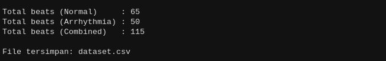

Visualisasikan plot hasil deteksi QRS-Peak pada segmen pertama sebagai contoh.

```m
% Plot QRS Complex Detection (untuk segmen pertama sebagai contoh)
% Ambil segmen pertama (0-10 detik)
idx_seg_first = (t >= 0) & (t < 10);
ecg_seg_first = y2(idx_seg_first);
t_seg_first = t(idx_seg_first);

% Pan-Tompkins untuk deteksi R-peaks
d_ecg = [0; diff(ecg_seg_first)] * Fs;
sq_ecg = d_ecg.^2;

mwi_ms = 150;
win = max(1, round((mwi_ms/1000)*Fs));
mwi = movmean(sq_ecg, win);

thr = median(mwi) + 0.5 * std(mwi);
min_dist = round(0.3 * Fs);
[~, mwi_locs] = findpeaks(mwi, 'MinPeakHeight', thr, 'MinPeakDistance', min_dist);

% Refine R-peaks
search_win = round(0.05 * Fs);
r_locs = zeros(size(mwi_locs));
for i = 1:numel(mwi_locs)
   L = max(1, mwi_locs(i) - search_win);
   R = min(length(ecg_seg_first), mwi_locs(i) + search_win);
   [~, rr] = max(ecg_seg_first(L:R));
   r_locs(i) = L + rr - 1;
end
r_locs = unique(r_locs);

% Deteksi Q dan S peaks
qrs_half_ms = 60;
qrs_half = round((qrs_half_ms/1000)*Fs);

q_locs = zeros(size(r_locs));
s_locs = zeros(size(r_locs));

for i = 1:numel(r_locs)
   r = r_locs(i);

   % Q peak: minimum sebelum R
   Lq = max(1, r - qrs_half);
   Rq = r;
   [~, iq] = min(ecg_seg_first(Lq:Rq));
   q_locs(i) = Lq + iq - 1;
   % S peak: minimum setelah R

   Ls = r;
   Rs = min(length(ecg_seg_first), r + qrs_half);
   [~, is] = min(ecg_seg_first(Ls:Rs));
   s_locs(i) = Ls + is - 1;
end

% Plot QRS Complex
figure('Color','black');
plot(t_seg_first, ecg_seg_first, 'b', 'LineWidth', 1.5); grid on; hold on

% Mark R peaks
plot(t_seg_first(r_locs), ecg_seg_first(r_locs), 'rv', 'MarkerSize', 8, 'LineWidth', 1.5, 'DisplayName', 'R peaks');

% Mark Q peaks
plot(t_seg_first(q_locs), ecg_seg_first(q_locs), 'yo', 'MarkerSize', 7, 'LineWidth', 1.5, 'DisplayName', 'Q peaks');

% Mark S peaks
plot(t_seg_first(s_locs), ecg_seg_first(s_locs), 'gs', 'MarkerSize', 7, 'LineWidth', 1.5, 'DisplayName', 'S peaks');

% Judul dan label
title('QRS Complex Detection (Segmen 0-10 s)', 'FontSize', 12, 'FontWeight', 'bold');
xlabel('Time (s)', 'FontSize', 11);
ylabel('ECG Amplitude (mV)', 'FontSize', 11);
legend('ECG Signal', 'R peaks', 'Q peaks', 'S peaks', 'Location', 'northeast', 'FontSize', 10);
xlim([t_seg_first(1) t_seg_first(end)]);
```

Hasil plot:

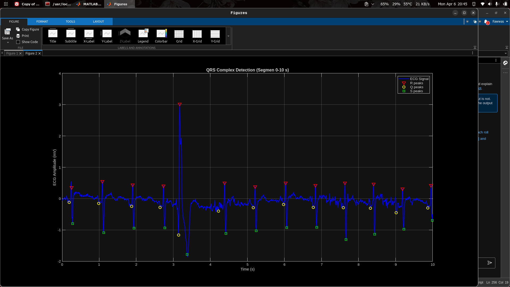


# **6\. Machine Learning**

Import dari dataset dari ekstraksi fitur sebelumnya.

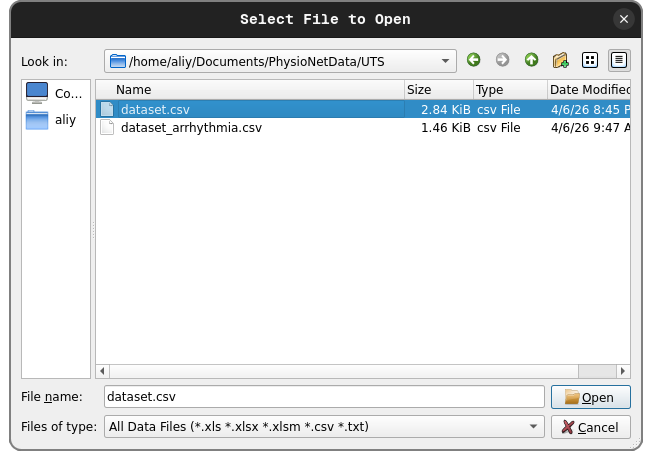


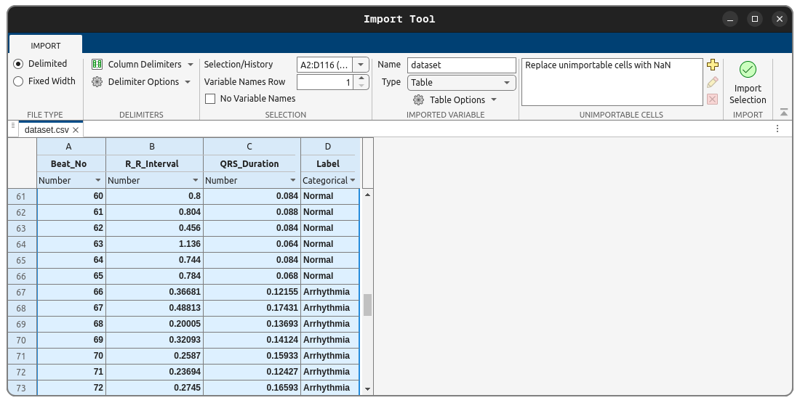


Pilih kolom fitur (Predictors) dan label (Response).

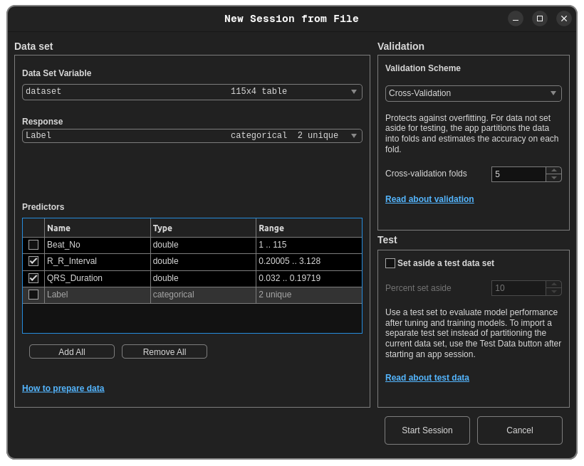


Menentukan models yang akan digunakan untuk perbandingan. Sebagai contoh: Decision Tree, SVM, KNN, dan Naive Bayes. Lalu, tentukan Hyperparameters tiap model.

1. Model Decision Tree:  
   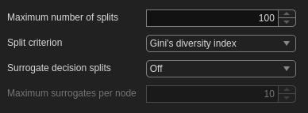

2. Model SVM:  
   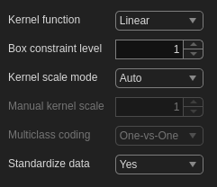

3. Model KNN:  
   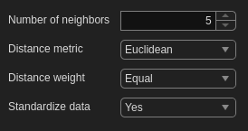

4. Model Naive Bayes:  
   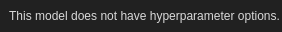


Hasil building model

1. Model Decision Tree:


2. Model SVM:

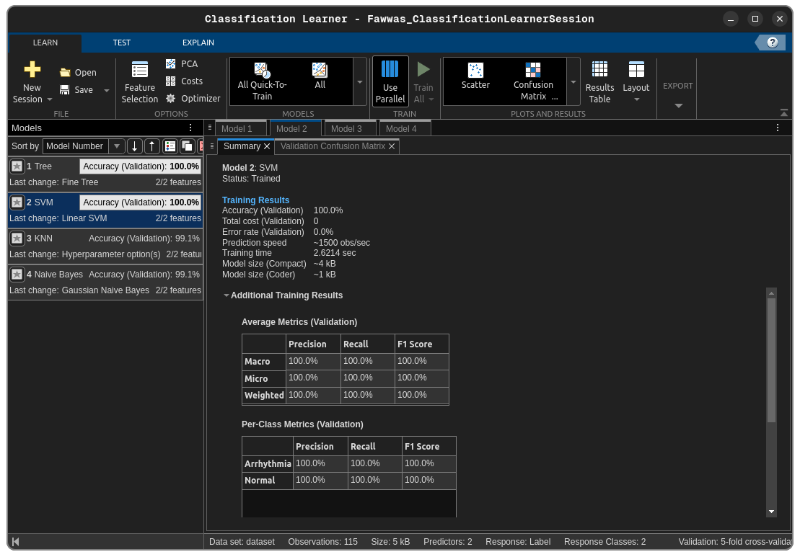


3. Model KNN:

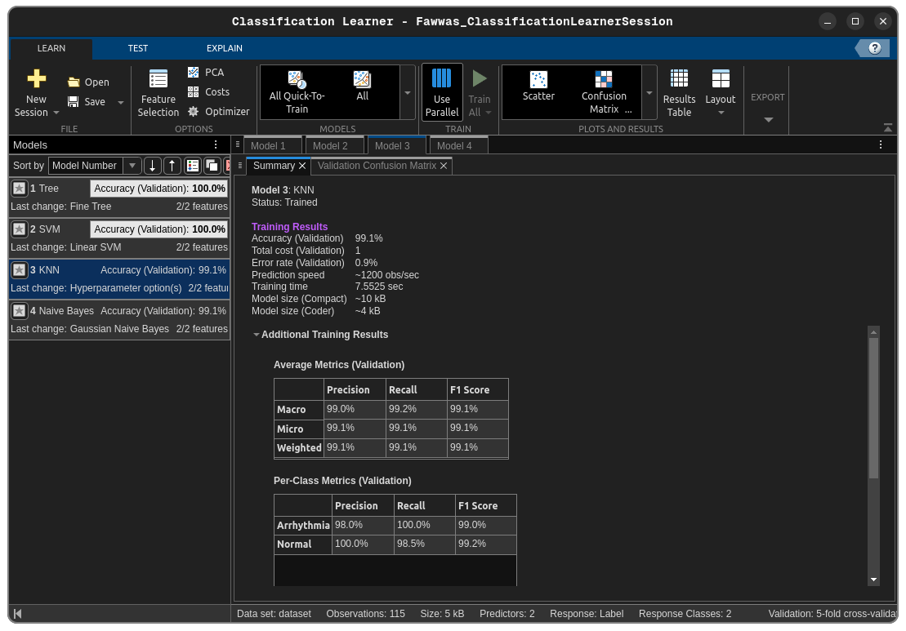


4. Model Naive Bayes:

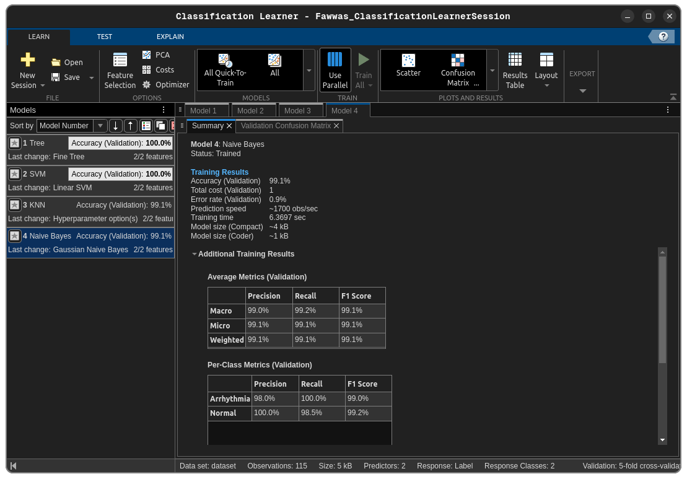


Kesimpulan:

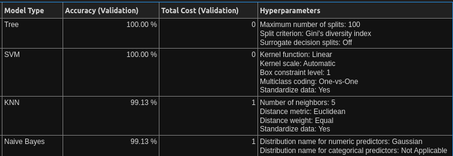


Dari ke-4 model tersebut, terlihat bahwa model **Decision Tree** dan **SVM** memberikan performa terbaik dengan **akurasi 100%**. Sedangkan model lainnya hampir sempurna.

Namun, dengan akurasi sempurna bisa berarti dataset memang sangat clean dan terpisah jelas, atau data terlalu sederhana.

# **Source:**

Github: [https://github.com/FechL/ECG-signal-processing](https://github.com/FechL/ECG-signal-processing)